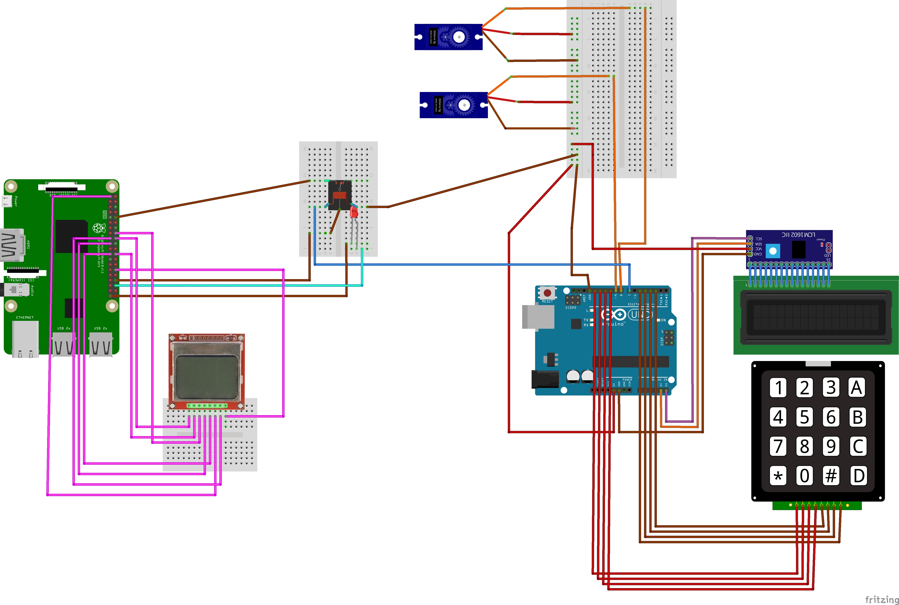

#Motion Time-lapse camera

- motion_control.ino - Arduino Uno motion control code

- timelapse_camera_display.py - Use this if you are using the Nokia 5110 display

- timelapse_camera_no_LCD.py - Use this if you are not using the Nokia 5110 display

[Arduino library for 12c display](http://playground.arduino.cc/Code/LCDi2c)

[Arduino library for 4*4 keypad](http://playground.arduino.cc/Code/Keypad)

[Python documentation for Nokia 5110 screen](https://cdn-learn.adafruit.com/downloads/pdf/nokia-5110-3310-lcd-python-library.pdf)
